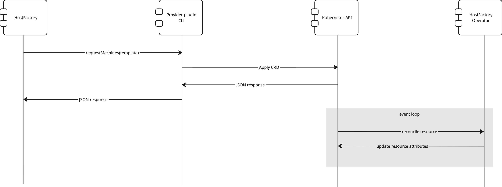
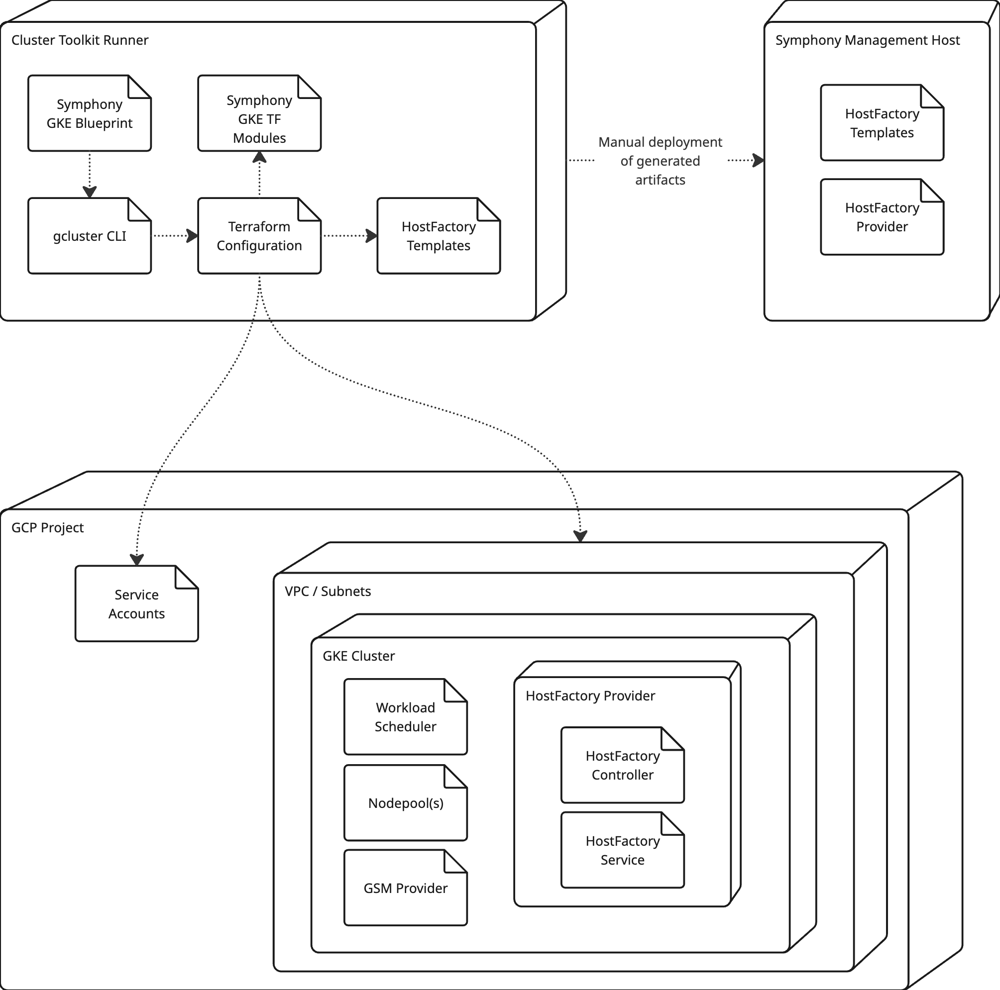
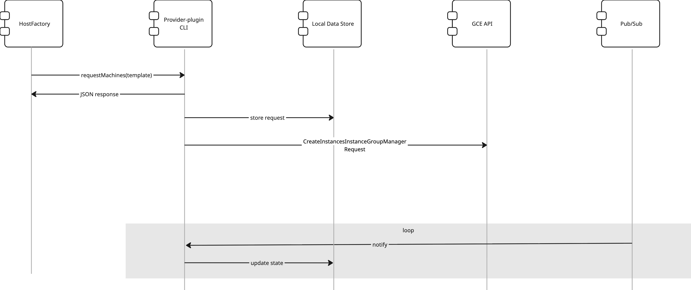
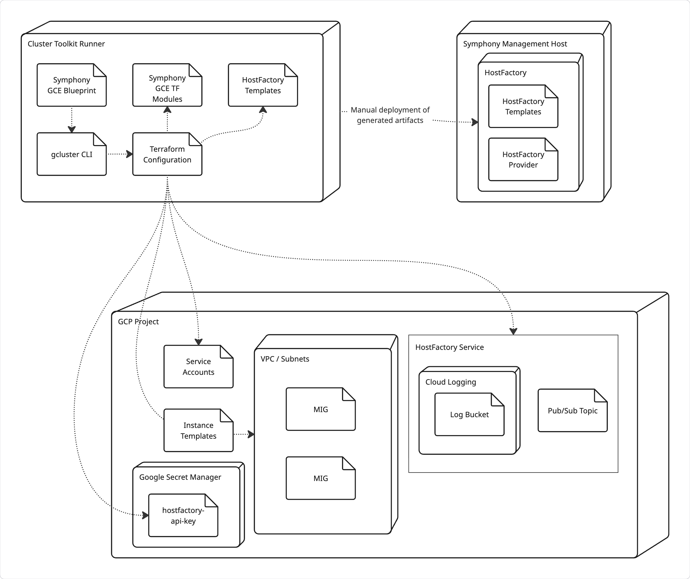

# HostFactory Provider Plug-in Implementation for GCP: Software Architecture

## Introduction

IBM Spectrum Symphony is a high-performance workload and resource orchestration platform designed for distributed computing environments. It enables organizations to efficiently run large volumes of concurrent compute-intensive tasks by dynamically allocating resources across a cluster of physical or virtual machines. Its integration with cloud provisioning systems—like IBM HostFactory—further allows for elastic scaling of compute resources on demand.

This document is a design proposal for implementing a **HostFactory provider plug-in for Google Cloud Platform (GCP)**. It outlines the architecture, configuration, and operational flow of the plug-in, which will enable IBM Spectrum Symphony’s HostFactory service to dynamically provision and release compute resources on GCP. The goal is to integrate Google’s GKE and GCE cloud offerings with HostFactory’s plug-in interface to support on-demand, policy-driven cluster scaling using custom resource templates and automation scripts.

## GKE Connector

### Class Diagram

### Shell Scripts

The scripts getAvailableTemplates.sh, getRequestStatus.sh, getReturnRequests.sh, requestMachines.sh, and requestReturnMachines.sh implement the [external interface](https://www.ibm.com/docs/en/spectrum-symphony/7.3.2?topic=factory-provider-plug-in-interface-specification#custom_provider_scripts) from IBM HostFactory to the GCP Provider plug-in.

These scripts receive JSON payloads as inputs and return JSON responses. They are designed to work asynchronously, in that a get request returns a request ID, which can be used to poll the plug-in for status.

Each script has minimal functionality; they merely execute the provider plug-in CLI, passing the request type (getAvailableTemplates, getRequestStatus, etc) and the JSON payload file location as arguments.

### Provider-plugin CLI

The hf-gce CLI is a Python script that accepts a command and a JSON payload, and interacts directly with the Kubernetes control plane to deploy or delete machine resources. Each command in the HostFactory external interface is implemented as follows:

| Command               | Input                                                        | Response                                                     |
| --------------------- | ------------------------------------------------------------ | ------------------------------------------------------------ |
| getAvailableTemplates | [JSON](https://www.ibm.com/docs/en/spectrum-symphony/7.3.2?topic=specification-getavailabletemplates) | [JSON](https://www.ibm.com/docs/en/spectrum-symphony/7.3.2?topic=specification-getavailabletemplates) |
| requestMachines       | [JSON](https://www.ibm.com/docs/en/spectrum-symphony/7.3.2?topic=specification-requestmachines) | [JSON](https://www.ibm.com/docs/en/spectrum-symphony/7.3.2?topic=specification-requestmachines) |
| getRequestStatus      | [JSON](https://www.ibm.com/docs/en/spectrum-symphony/7.3.2?topic=specification-getrequeststatus) | [JSON](https://www.ibm.com/docs/en/spectrum-symphony/7.3.2?topic=specification-getrequeststatus) |
| requestReturnMachines | [JSON](https://www.ibm.com/docs/en/spectrum-symphony/7.3.2?topic=specification-requestreturnmachines) | [JSON](https://www.ibm.com/docs/en/spectrum-symphony/7.3.2?topic=specification-requestreturnmachines) |
| getReturnRequests     | [JSON](https://www.ibm.com/docs/en/spectrum-symphony/7.3.2?topic=specification-getreturnrequests) | [JSON](https://www.ibm.com/docs/en/spectrum-symphony/7.3.2?topic=specification-getreturnrequests) |

In each instance, the JSON payloads conform to the HostFactory Provider plug-in interface.

The CLI is configured via a JSON file containing properties of ProviderConfiguration.

The CLI will discover and authenticate with the Kubernetes cluster via a Kubernetes config file, specified in ProviderConfiguration.

### CLI Overview

#### getAvailableTemplates

1. Retrieve optional JSON payload from the file system, typically an ephemeral file located in /tmp directory.
2. Retrieve the template configuration file gcpgkeinstprov_templates.json
3. Filter the available templates based on parameters in the JSON payload
4. Output the filtered templates to STDOUT,

#### requestMachines

1. Retrieve the JSON payload from the file system.
2. Retrieve the available templates.
3. Find the host template via templateId.
4. Lookup the host template’s PodSpec, specified by the template’s podSpecYaml property, which is a reference to the file within the provider directory.
5. Generate a CustomResource manifest based on a reference CRD. A single reference CRD can be used to deploy any host template.
6. Attach the PodSpec to the CustomResource.
7. Apply the CustomResource via the Kubernetes API.

### HostFactoryOperator

The HostFactoryOperator is a custom Kubernetes operator that serves the GCP HostFactory Provider Service REST API and acts on the commands it receives. The operator is implemented in two parts:

This class is a Kubernetes operator that will:

- Register itself to manage the GCPSymphonyResource CRD.
- When notified of a new deployment:
  - Determine which node pool should be used (or allow Custom Compute Classes to determine the node pool)
  - Deploy pods to the node pool
  - Update the CR with metadata to track
- Monitor pod state and update the CR to indicate deletions or other boundary conditions.

### Custom Compute Classes

The HostFactory provider will support Google Cloud’s Custom Compute Classes passively, in that no special functionality is required. Custom Compute Classes will be supported as follows:

1. Administrator defines one or more ComputeClass CRs, for any given strategy. Likely scenarios include:
   1. Performance-optimized CPU compute, with fallback to lower machine families
   2. Performance-optimized GPU compute, with fallback to lower machine families
   3. Cost-optimized CPU compute, with fallback to more expensive machine families
   4. Cost-optimized GPU compute, with fallback to more expensive machine families
   5. Spot CPU compute with fallback to regular instances
   6. Spot GPU compute with fallback to regular instances

2. The CTk Blueprint will include documentation to illustrate sample CR manifests.

3. Administrator applies the ComputeClass manifests to Kubernetes

4. Administrator will include the ComputeClass in a host template’s PodSpec via the nodeSelector property.

   

## Sequences

The diagram above depicts the interactions between the GKE implementation of the Provider CLI, Kubernetes API, and HostFactory Operator. This interaction shows the requestMachines flow, but the remaining command flows are similar.

Upon receiving a requestMachines command, the CLI will generate a Custom Resource (CR) manifest that specifies the resources requested by the command. The CR manifest is applied via the Kubernetes API.

Kubernetes will trigger the HostFactory Operator in response to the CR manifest to reconcile state, by deploying and managing pods as needed.

## Deployments

### Cluster Toolkit Runner

This is a PC or VM, running locally or in the cloud, that runs Google Cluster Toolkit (GCTk). The runner will have a clone of the [cluster-toolkit](https://github.com/GoogleCloudPlatform/cluster-toolkit) repo and its associated dependencies, and will be authenticated against Google Cloud via the gcloud CLI.

The Symphony GKE blueprint and associated Terraform modules will be included in the cluster-toolkit repo. The blueprint will:

- Generate hostfactory templates and provider configuration based on settings in the blueprint. These files can be manually deployed to the IBM Symphony Management host.
- Deploy service accounts needed for the REST API to perform its functions.
- Generate and deploy an API key to Google Secret Manager GSM.
- Deploy a VPC and subnet to the specified GCP Project.
- Deploy a GKE cluster, including:
  - The HostFactory Provider components
  - Workload Scheduler to support DWS
  - Any nodepools that are necessary to service the getMachines requests
  - Deploy the GSM Provider to allow the HostFactory Service to access the API key.

## GCE Connector

### Class Diagram

### Shell Scripts

The scripts getAvailableTemplates.sh, getRequestStatus.sh, getReturnRequests.sh, requestMachines.sh, and requestReturnMachines.sh implement the [external interface](https://www.ibm.com/docs/en/spectrum-symphony/7.3.2?topic=factory-provider-plug-in-interface-specification#custom_provider_scripts) from IBM HostFactory to the GCP Provider plug-in.

These scripts receive JSON payloads as inputs and return JSON responses. They are designed to work asynchronously, in that a get request returns a request ID, which can be used to poll the plug-in for status.

Each script has minimal functionality; they merely execute the provider plug-in CLI, passing the request type (getAvailableTemplates, getRequestStatus, etc) and the JSON payload file location as arguments.

### Provider-plugin CLI

The hf-gce CLI is a Python script that accepts a command and a JSON payload, and interacts directly with the Kubernetes control plane to deploy or delete machine resources. Each command in the HostFactory external interface is implemented as follows:

| Command               | Input                                                        | Response                                                     |
| --------------------- | ------------------------------------------------------------ | ------------------------------------------------------------ |
| getAvailableTemplates | [JSON](https://www.ibm.com/docs/en/spectrum-symphony/7.3.2?topic=specification-getavailabletemplates) | [JSON](https://www.ibm.com/docs/en/spectrum-symphony/7.3.2?topic=specification-getavailabletemplates) |
| requestMachines       | [JSON](https://www.ibm.com/docs/en/spectrum-symphony/7.3.2?topic=specification-requestmachines) | [JSON](https://www.ibm.com/docs/en/spectrum-symphony/7.3.2?topic=specification-requestmachines) |
| getRequestStatus      | [JSON](https://www.ibm.com/docs/en/spectrum-symphony/7.3.2?topic=specification-getrequeststatus) | [JSON](https://www.ibm.com/docs/en/spectrum-symphony/7.3.2?topic=specification-getrequeststatus) |
| requestReturnMachines | [JSON](https://www.ibm.com/docs/en/spectrum-symphony/7.3.2?topic=specification-requestreturnmachines) | [JSON](https://www.ibm.com/docs/en/spectrum-symphony/7.3.2?topic=specification-requestreturnmachines) |
| getReturnRequests     | [JSON](https://www.ibm.com/docs/en/spectrum-symphony/7.3.2?topic=specification-getreturnrequests) | [JSON](https://www.ibm.com/docs/en/spectrum-symphony/7.3.2?topic=specification-getreturnrequests) |

In each instance, the JSON payloads conform to the HostFactory Provider plug-in interface.

The gce-hf CLI adds two additional commands:

- initializeDB: Initializes a local database to record the states of machines and requests
- monitorEvents: Listens to a PubSub subscription to receive and respond to VM events

The CLI is configured via a JSON file containing properties of ProviderConfiguration.

The CLI will authenticate with the Google Cloud API via a credentials file, specified in ProviderConfiguration.

### CLI Overview

#### getAvailableTemplates

1. Retrieve optional JSON payload from the file system, typically an ephemeral file located in /tmp directory.
2. Retrieve the template configuration file gcpgkeinstprov_templates.json
3. Filter the available templates based on parameters in the JSON payload
4. Output the filtered templates to STDOUT,

#### requestMachines

1. Retrieve the JSON payload from the file system.
2. Retrieve the available templates.
3. Find the host template via templateId.
4. Lookup the host template’s GCE Instance Group and Zone.
5. Store the request in the local database.
6. Submit a request through the Compute API to add a new instance to the group.
7. Wait for the VM to be created.
8. Determine the VM's IP address and store in the local database.

### PubSub event listener

The hf-gce CLI has a separate *event listener* mode that launches a process that listens to the Google Cloud PubSub API for VM creation and deletion events. The event listener stores machine state in a local database. Any requests to the CLI for the status of requests will be fulfilled by querying the local database.

## Sequences

The diagram above depicts the interactions between the GCE implementation of the Provider, the local data store, and Google Cloud. This interaction shows the requestMachines flow, but the remaining command flows are similar.

Upon receiving a requestMachines command, the CLI will:

- Store the request in the local data store
- Create placeholder records for the machines that were requested
- Lookup the GCE Instance Group and Zone from the HostFactory template
- Issue a `InstanceGroupManagersCreateInstancesRequest` to the Google Cloud Compute API

Asynchronously, the CLI, in event listener mode, will:

- Listen for a `createInstances` event.
- When the event occurs, get the VM's IP address from the Compute API, and store that in the local data store along with updated status of the machines

## Deployments

